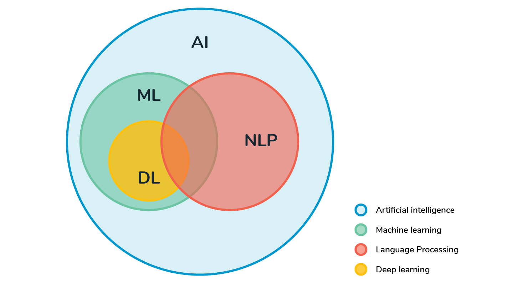
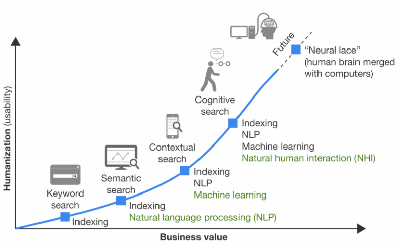
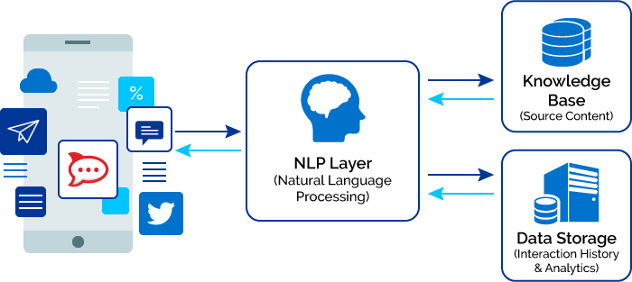
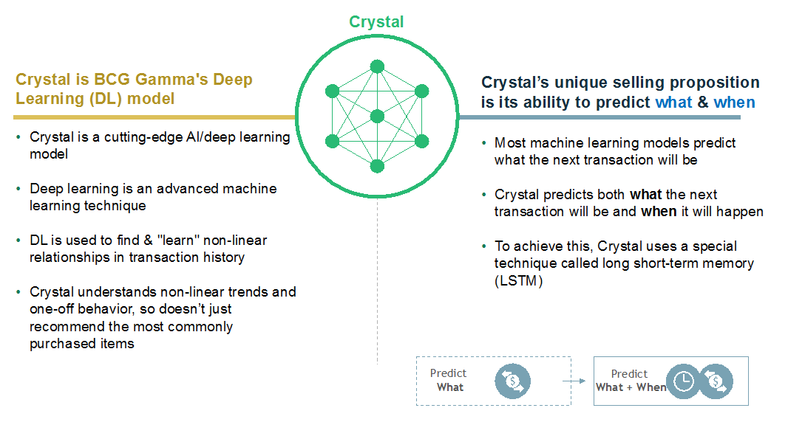

---
output:
  html_document:
    css: Estilos.css
---

 <h1> <b> Introducción ligera </b> </h1> 

 <h1> <b> El valor en el negocio </b> </h1> 

+ Marketing, prospección y predicción.

 <h1> <b> Aprendizaje en NLP </b> </h1> 

+ Funcionamiento de chatbots

 <h1> <b> Un ejemplo de aplicación </b> </h1> 

+ Link de referencia: [BCG GAMMA Blog](https://medium.com/bcggamma/using-deep-learning-to-predict-not-just-what-but-when-fae6515acb1b)

