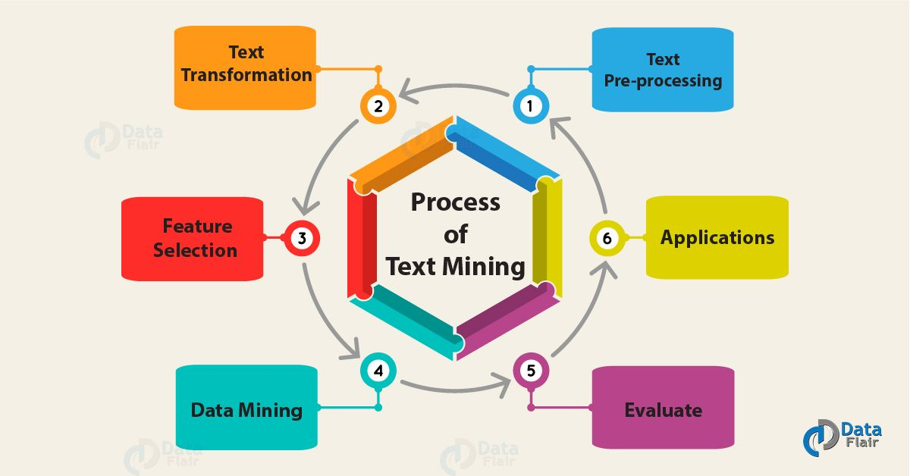

---
output:
  html_document:
    css: Estilos.css
---

```{r setup, include=FALSE}
knitr::opts_chunk$set(echo = FALSE)
knitr::opts_chunk$set(warning = FALSE)
knitr::opts_chunk$set(message = FALSE)
options(knitr.kable.NA = '')
library(readxl)
library(dplyr)
library(kableExtra)
```

<center> <h1> <b> Procesamiento del lenguaje natural </b> </h1> </center>

<center> Es un campo de la inteligencia artificial, enraizado en la lingüística computacional, introducido alrededor de 1950 y enfocado en hacer que las máquinas entiendan, interpreten y manipulen el lenguaje natural evolucionado para el uso humano.</center>

<center> <h1> <b> Principales usos del NLP </b> </h1> </center>

<center></center>

+ *Traducción automática*
+ *Sistemas de reconocimiento del habla*
+ *Sistemas de consulta de preguntas*
+ *Reconocimiento contextual*
+ *Resumen de documentos*
+ *Categorización de texto*

<center> <h1> <b> Analítica de texto o text-mining </b> </h1> </center>

<center></center>

+ Metodología seguida para descubrir información relevante que es desconocida o está escondida bajo lo obvio.

+ Principales técnicas:
  + Clasificación de texto
  + Clustering de texto
  + Resumen de texto
  + Análisis de sentimientos
  + Reconocimiento y extracción de entidades
  + Análisis de similaridades y modelamiento de relaciones
  
+ Aplicaciones más populares:
  + Detección de spam
  + Categorización de noticias
  + Análisis de redes sociales
  + Marketing y CRM
  + Análisis de sentimientos
  + Uso de publicidad
  + Chatbots
  + Asistentes virtuales

<center> <h1> <b> Estado del arte </b> </h1> </center>

```{r warning=FALSE, message=FALSE}
EstadoArte=read_excel("TablasTeoria.xlsx", sheet = "EstadoArte")
kable(EstadoArte, align = "c") %>%
  kable_styling(bootstrap_options = c("striped","bordered")
                , full_width = F, position = "center") %>% 
  row_spec(1:nrow(EstadoArte), background = "skyblue", color = "black")
```

