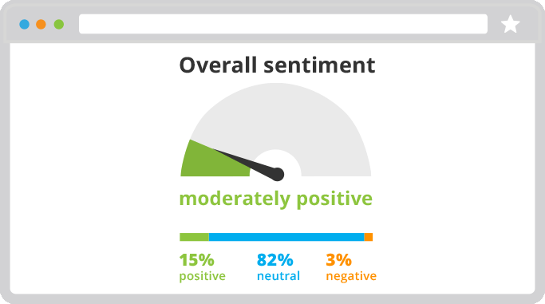
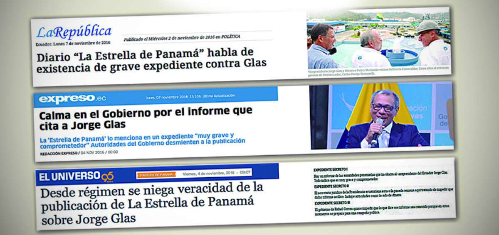

---
output:
  html_document:
    css: Estilos.css
---

# *Algunas definiciones*

+ *Corpus:* Conjunto de datos de texto largos y estructurados, almacenados en formato electrónico y con metadata adicional. Corpora es el plural de corpus.
+ Es utilizado en el análisis estadístico y la creación de herramientas de NLP.
+ Técnicas de pre-procesamiento a usarse:
  + Eliminación de 'stopwords'
  + Tokenizacion
  + Stemming
  + Lematización
  
# *Nuestra principal guía*

[Text Mining with R](https://www.tidytextmining.com/) (2019) por Julia Silge y David Robinson. 

 **CASO PRÁCTICO:**
<center> <h1> <b> WEB LISTENING Y NLP PARA EXTRAER INFORMACIÓN DE NOTICIAS WEB </b> </h1> </center>

<left> <h3> <b> ¿Qué es el Web Listening? </b> </h3> </left>


 Es el proceso que identifica lo que se dice sobre una entidad (persona, empresa,país, partido político, etc.) en fuentes de datos como: periódicos en línea, redes sociales y blogs.


<left> <h3> <b> NLP para los titulares de periódicos online </b> </h3> </left>

+ Los periódicos en línea como El Universo, El Comercio, entre otros; son fuentes lingüísticas invaluables para determinar el análisis de texto. La adquisición sistemática de datos de artículos de periódicos para crear un corpus de texto, que permita realizar el análisis de texto puede hacerse mediante web listening.

+ Hoy, la mayoría de los lectores de noticias leen la versión en línea de los artículos de noticias en lugar de los periódicos tradicionales en papel.

+ Este caso práctico ilustrará cómo ejecutar la extracción diaria, transformación y carga (ETL) de artículos a partir de palabras clave encontradas en los encabezados de los diarios en línea.

+ Los periódicos en línea dedican mucho esfuerzo para escribir titulares interesantes que capten la atención de los usuarios en línea.

+ El titular de la noticia proporciona la esencia de un artículo de noticias que ayuda al lector a comprender la idea completa de las noticias sin leerlas. 

<span style="padding-left:15px">

<center></center>

<span style="padding-left:15px">


+ El *objetivo* es: analizar los sentimientos expresados en las noticias y realizar un modelado de tópicos para identificar si existe relación entre ellos.

+ En política, poder rastrear un artículo en todos los medios y medir tanto el sentimiento como el consenso podría ser una herramienta útil para rastrear la opinión pública y ajustar los mensajes.

<span style="padding-left:15px">

<center></center>

<span style="padding-left:15px">


<left> <h3> <b> ¿Porqué es importante? </b> </h3> </left>

+ Para tener una visión extendida de la información que está siendo entregada a las personas sobre algún tema.

+ Manejo de crisis, este análisis también ayuda a abordar los desastres de relaciones públicas antes de que se salgan de control. Si el sentimiento es negativo, las acciones apropiadas podrían evitar un paso en falso similar en el futuro.

+ Rastrear competidores, para comprender lo que ocurre con sus competidores.También se podría saber qué hacen sus competidores en tiempo real. ¿Están lanzando una nueva campaña?, ¿Desarrollando nuevas estrategias?, ¿Están recibiendo una paliza en la prensa?

+ El análisis de texto le permite conocer estas nuevas oportunidades y amenazas a medida que ocurren, para que pueda planificar y responder en consecuencia.

<span style="padding-left:15px">

<center></center>

<span style="padding-left:15px">

+ Adicionalmente, una de la sutilidades más importantes será el identificar noticias falsas o que atentan contra la reputación del ente para tomar acciones inmediatas.

<span style="padding-left:15px">

<center></center>

<span style="padding-left:15px">

Para desarrollar el caso práctico, buscamos en diarios nacionales las siguientes palabras: *Jorge Yunda Quito* y *Cynthia Viteri Guayaquil* en el periodo de timpo de los últimos siete días para los diarios: El Comercio, Diario la Opinión, Diario Ecuador, Diario el Telégrafo, El Universo, El Extra, entre otros.

<span style="padding-left:15px">

<center></center>

<span style="padding-left:15px">
  
# **Nuestra principal guía**

[Text Mining with R](https://www.tidytextmining.com/) (2019) por Julia Silge y David Robinson. 

# **Carga de librerías**

```{r carga_librerias, message=F, warning=F}
library(tidyverse) # Manejo y carga de datos en formato tidy
library(tidytext) # Manejo de texto en formato tidy
library(tm) # Procesamiento de texto
library(readxl) # Lectura de archivos excel
library(udpipe) # Modelos diseñados para lematización
```

# **Carga de los datos recolectados**

```{r carga_datos}
load("noticiasDF.RData")
noticiasYundaDF$Acerca = "Jorge Yunda"
noticiasViteriDF$Acerca = "Cynthia Viteri"
NoticiasDF = rbind.data.frame(noticiasViteriDF, noticiasYundaDF)
NoticiasDF$noticia = NoticiasDF$Noticia
NoticiasDF$titular = NoticiasDF$Titular
NoticiasDF = NoticiasDF[!is.na(NoticiasDF$Noticia),]
head(NoticiasDF)
```

# **Ejemplos de noticias**

```{r ejemplo_noticia1}
str(NoticiasDF$noticia[NoticiasDF$titular=="Alcaldesa Cynthia Viteri anunció nuevas medidas en Guayaquil"], nchar.max = 500)
```

# **Eliminación de stopwords**

```{r primera_limpieza}
NoticiasDF$noticiaLimpia = removePunctuation(NoticiasDF$noticia)
NoticiasDF$noticiaLimpia = removeNumbers(NoticiasDF$noticiaLimpia)
NoticiasDF$noticiaLimpia = tolower(NoticiasDF$noticiaLimpia)
```

```{r stopwords_base}
stopwords_es_1 = read_excel("CustomStopWords.xlsx")
stopwords_es_2 = tibble(Palabra=tm::stopwords(kind = "es"), Fuente="tm")
stopwords_es_3 = tibble(Palabra=stopwords::stopwords(language = "es", source = "stopwords-iso")
                        , Fuente="stopwords-iso")
stopwords_es_4 = tibble(Palabra=stopwords::stopwords(language = "es", source = "snowball")
                        , Fuente="snowball")
stopwords_es = rbind(stopwords_es_1, stopwords_es_2, stopwords_es_3, stopwords_es_4)
stopwords_es = stopwords_es[!duplicated(stopwords_es$Palabra),]
remove(stopwords_es_1, stopwords_es_2, stopwords_es_3, stopwords_es_4)

stopwords_es[sample(nrow(stopwords_es),size = 10, replace = F),]
```

```{r eliminar_stopwords}
NoticiasDF$noticiaLimpia = removeWords(NoticiasDF$noticiaLimpia, words = stopwords_es$Palabra)
NoticiasDF$noticiaLimpia = str_squish(NoticiasDF$noticiaLimpia)
```

Resultados:

```{r ejemplo_noticia_limpia1}
str(NoticiasDF$noticiaLimpia[NoticiasDF$titular=="Alcaldesa Cynthia Viteri anunció nuevas medidas en Guayaquil"], nchar.max = 500)
```


# **Lematización**

[UDPipe, Facultad de Matemáticas y Física de la Universidad de República Checa](http://ufal.mff.cuni.cz/udpipe)

```{r lematizacion}
# Lematizacion udpipe
model <- udpipe_load_model(file = "udpipe model spanish/spanish-gsd-ud-2.4-190531.udpipe")
udpipe_lema <- udpipe_annotate(model, x = NoticiasDF$noticia, doc_id = NoticiasDF$titular)
udpipe_lema <- as_tibble(udpipe_lema)

udpipe_lema %>%
  unnest_tokens(output = Palabra, input = token) %>% 
  anti_join(stopwords_es) -> udpipe_lema

udpipe_lema[udpipe_lema$Palabra=="decidió",c("Palabra","lemma")]
udpipe_lema[udpipe_lema$Palabra=="trabajando",c("Palabra","lemma")]
```

# **Tokenización**

```{r tokenizacion}
# Tokenización por palabras
tidy_NoticiasDF <- NoticiasDF %>%
  unnest_tokens(output = Palabra,input = noticiaLimpia)

# Tokenización por n-gramas
tidy_NoticiasDF_ngram3 <- NoticiasDF %>%
  unnest_tokens(output = Palabra,input = noticiaLimpia, token = "ngrams", n = 3)

# La función se encarga de descartar puntuación y caracteres especiales, todo en minúsculas
head(tidy_NoticiasDF$Palabra[tidy_NoticiasDF$titular=="Alcaldesa Cynthia Viteri anunció nuevas medidas en Guayaquil"], n = 20)

head(tidy_NoticiasDF_ngram3$Palabra[tidy_NoticiasDF_ngram3$titular=="Alcaldesa Cynthia Viteri anunció nuevas medidas en Guayaquil"], n = 20)

# Tokenización final a partir del DF lematizado
tidy_NoticiasDF = udpipe_lema %>% 
  filter(!is.na(lemma)) %>% 
  unnest_tokens(output = Palabra, input = Palabra)

names(tidy_NoticiasDF)[which(names(tidy_NoticiasDF)=="doc_id")] = "titular"
head(tidy_NoticiasDF$lemma[tidy_NoticiasDF$titular=="Alcaldesa Cynthia Viteri anunció nuevas medidas en Guayaquil"], n = 20)

```

# **Stemming**

```{r stemming}
tidy_NoticiasDF$Stem = stemDocument(tidy_NoticiasDF$Palabra, language="spanish")
tidy_NoticiasDF[tidy_NoticiasDF$Palabra=="decidió",c("Palabra","lemma","Stem")]
tidy_NoticiasDF[tidy_NoticiasDF$Palabra=="ecuatoriano",c("Palabra","lemma","Stem")]

tidy_NoticiasDF %>% 
  inner_join(NoticiasDF[c("titular","Fecha","Diario")], by="titular") -> tidy_NoticiasDF
save("NoticiasDF","tidy_NoticiasDF",file = "NoticiasDF_udpipe_lema.RData")
```


