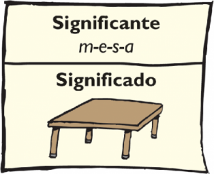
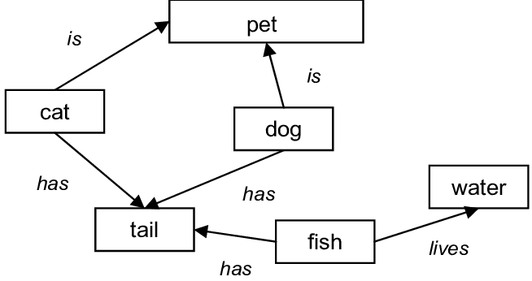

---
output:
  html_document:
    css: Estilos.css
---

 <h1> <b> ¿Qué es la semántica? </b> </h1> 

 Es el estudio del significado en el lenguaje, las relaciones entre palabras, frases y símbolos; así como el conocimiento que representan.

...

 <h1> <b> Redes Semánticas </b> </h1> 

 <h1> <b> Lógica de primer orden </b> </h1> 

