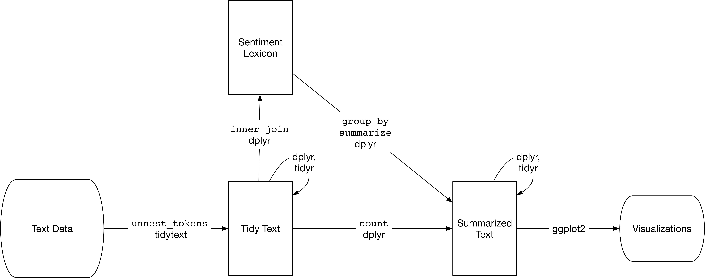

---
output:
  html_document:
    css: Estilos.css
---

# **Carga de librerías**

```{r carga_librerias, message=F, warning=F}
library(tidyverse) # Manejo y carga de datos en formato tidy
library(tidytext) # Manejo de texto en formato tidy
library(readxl) # Lectura de archivos excel
library(RColorBrewer) # Paletas de colores
library(kableExtra) # Formato de tablas
library(formattable) # Formato de tablas
library(scales) # Formatos de número
```

# **Correlación de Diarios: El Comercio y El Universo**

```{r}
load("NoticiasDF_udpipe_lema.RData")

PrimerCOR <- bind_rows(tidy_NoticiasDF %>% filter(Diario=="El Comercio (Ecuador)")
                       , tidy_NoticiasDF %>% filter(Diario=="El Universo")) %>% 
  count(Diario, lemma) %>%
  group_by(Diario) %>%
  mutate(Proporcion = n / sum(n)) %>% 
  select(-n) %>% 
  spread(Diario, Proporcion)

ggplot(PrimerCOR, aes(x = `El Comercio (Ecuador)`
                       , y = `El Universo`)) +
  geom_abline(color = "gray40", lty = 2) +
  geom_jitter(alpha = 0.1, size = 2.5, width = 0.3, height = 0.3) +
  geom_text(aes(label = lemma), check_overlap = TRUE, vjust = 1.5, family = "serif") +
  scale_x_log10(labels = percent_format()) +
  scale_y_log10(labels = percent_format()) +
  labs(x = "El Comercio", y = "El Extra")+
  theme(text = element_text(family = "serif", size = 16))
```

# **Correlación de Diarios: El Comercio y El Expreso**

```{r}
SegunCOR <- bind_rows(tidy_NoticiasDF %>% filter(Diario=="El Comercio (Ecuador)")
                       , tidy_NoticiasDF %>% filter(Diario=="expreso.ec")) %>% 
  count(Diario, lemma) %>%
  group_by(Diario) %>%
  mutate(Proporcion = n / sum(n)) %>% 
  select(-n) %>% 
  spread(Diario, Proporcion)

ggplot(SegunCOR, aes(x = `El Comercio (Ecuador)`
                       , y = `expreso.ec`)) +
  geom_abline(color = "gray40", lty = 2) +
  geom_jitter(alpha = 0.1, size = 2.5, width = 0.3, height = 0.3) +
  geom_text(aes(label = lemma), check_overlap = TRUE, vjust = 1.5, family = "serif") +
  scale_x_log10(labels = percent_format()) +
  scale_y_log10(labels = percent_format()) +
  labs(x = "El Comercio", y = "El Telégrafo")+
  theme(text = element_text(family = "serif", size = 16))
```

# **Term frequency - Inverse document frequency**

+ **tf (term frequency):** Qué tan frecuentemente aparece una palabra en un documento.
$$tf = \frac{n}{total}$$
+ **idf (inverse document frequency):** Asigna pesos bajos a palabras muy usadas y pesos altos a palabras poco usadas.
$$idf = log\left(\frac{documentos_{total}}{documentos_{término}}\right)$$
+ **tf-idf:** Se obtiene multiplicando *tf* por *idf* y mide la frecuencia de un término, ajustándola según que tan raro sea su uso.

```{r}
tidy_NoticiasDF %>%
  count(lemma, Diario, sort = TRUE) -> conteos_lemas
head(conteos_lemas)

conteos_lemas <- conteos_lemas %>%
  bind_tf_idf(lemma, Diario, n)

conteos_lemas %>%
  filter(Diario %in% c("El Comercio (Ecuador)","El Universo","El Telégrafo","expreso.ec")) %>% 
  arrange(desc(tf_idf)) %>%
  mutate(value = factor(lemma, levels = rev(unique(lemma)))) %>% 
  group_by(Diario) %>% 
  top_n(15) %>% 
  ungroup() %>%
  ggplot(aes(value, tf_idf, fill = Diario)) +
  geom_col(show.legend = FALSE) +
  labs(x = NULL, y = "tf-idf") +
  facet_wrap(~Diario, ncol = 2, scales = "free") +
  coord_flip()+
  theme(legend.position = "none")
```

# **Análisis de sentimientos**

<center></center>

# **Carga de diccionarios de sentimientos**

```{r}
DiccionarioPositivo = read.delim("sentiment-lexicons/positive_words_es.txt")
names(DiccionarioPositivo) = "lemma"
DiccionarioPositivo$Sentimiento = "Positivo"
DiccionarioNegativo = read.delim("sentiment-lexicons/negative_words_es.txt")
names(DiccionarioNegativo) = "lemma"
DiccionarioNegativo$Sentimiento = "Negativo"
DiccionarioSentimientos = rbind.data.frame(DiccionarioPositivo, DiccionarioNegativo)
DiccionarioSentimientos$Sentimiento[DiccionarioSentimientos$lemma=="paciente"] = "Negativo"
DiccionarioSentimientos$Sentimiento[DiccionarioSentimientos$lemma=="agudo"] = "Negativo"

tidy_NoticiasDF %>%
  inner_join(DiccionarioSentimientos) %>%
  count(lemma, Sentimiento, sort = TRUE) %>% 
  ungroup() -> SentimentAnalysis1

SentimentAnalysis1 %>%
  group_by(Sentimiento) %>%
  top_n(10) %>%
  ungroup() %>%
  mutate(value = reorder(lemma, n)) %>%
  ggplot(aes(value, n, fill = Sentimiento)) +
  geom_col(show.legend = FALSE) +
  facet_wrap(~Sentimiento, scales = "free_y") +
  labs(y = "Frecuencia", x = "Lema") +
  coord_flip() +
  theme(legend.position = "none")

DiccionarioSentimientos2 = read.csv("lexico_afinn.en.es.csv")
DiccionarioSentimientos2 %>% 
  mutate(Sentimiento = ifelse(Puntuacion > 0, "Positiva", "Negativa")) -> DiccionarioSentimientos2
names(DiccionarioSentimientos2) = c("lemma","Puntuacion","Word","Sentimiento")
DiccionarioSentimientos2$Sentimiento[DiccionarioSentimientos2$lemma=="evitar"] = "Positiva"

tidy_NoticiasDF %>%
  inner_join(DiccionarioSentimientos2) %>%
  count(lemma, Sentimiento, sort = TRUE) %>% 
  ungroup() -> SentimentAnalysis2

SentimentAnalysis2 %>%
  group_by(Sentimiento) %>%
  top_n(10) %>%
  ungroup() %>%
  mutate(value = reorder(lemma, n)) %>%
  ggplot(aes(value, n, fill = Sentimiento)) +
  geom_col(show.legend = FALSE) +
  facet_wrap(~Sentimiento, scales = "free_y") +
  labs(y = "Frecuencia", x = "Lema") +
  coord_flip() +
  theme(legend.position = "none")
```

# **Sentimientos en El Comercio y El Universo**

```{r}
tidy_NoticiasDF %>%
  filter(Diario %in% c("El Comercio (Ecuador)","El Universo")) %>% 
  inner_join(DiccionarioSentimientos2) %>%
  count(lemma, Sentimiento, Diario, sort = TRUE) %>% 
  ungroup() -> SentimentAnalysis3

SentimentAnalysis3 %>%
  group_by(Diario, Sentimiento) %>%
  top_n(10) %>%
  ungroup() %>%
  mutate(value = reorder(lemma, n)) %>%
  ggplot(aes(value, n, fill = Sentimiento)) +
  geom_col(show.legend = FALSE) +
  facet_wrap(Diario~Sentimiento, scales = "free_y") +
  labs(y = "Frecuencia", x = "Lema") +
  coord_flip() +
  theme(legend.position = "none")
```

# **Sentimientos en El Comercio y El Expreso**

```{r}
tidy_NoticiasDF %>%
  filter(Diario %in% c("El Comercio (Ecuador)","expreso.ec")) %>% 
  inner_join(DiccionarioSentimientos2) %>%
  count(lemma, Sentimiento, Diario, sort = TRUE) %>% 
  ungroup() -> SentimentAnalysis4

SentimentAnalysis4 %>%
  group_by(Diario, Sentimiento) %>%
  top_n(10) %>%
  ungroup() %>%
  mutate(value = reorder(lemma, n)) %>%
  ggplot(aes(value, n, fill = Sentimiento)) +
  geom_col(show.legend = FALSE) +
  facet_wrap(Diario~Sentimiento, scales = "free_y") +
  labs(y = "Frecuencia", x = "Lema") +
  coord_flip() +
  theme(legend.position = "none")
```