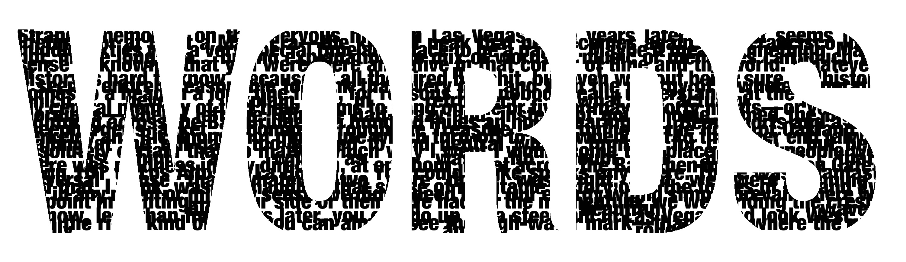
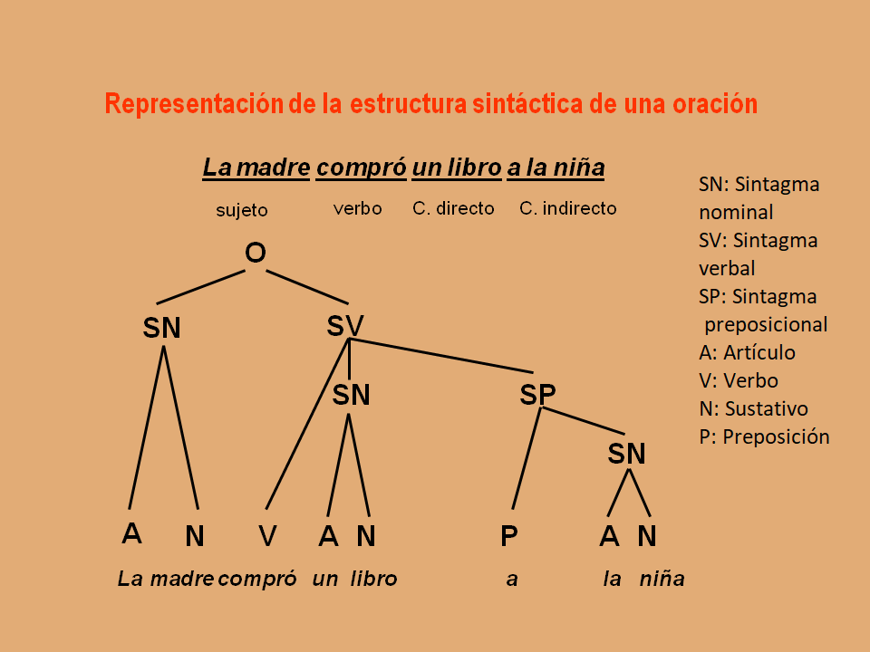

---
output:
  html_document:
    css: Estilos.css
---

 <h1> <b> Palabras </b> </h1> 

+ Utiles de conocer y analizar para el procesamiento de texto, anotaciones, análisis sintáctico, clasificación y resumen del texto.
+ En el español las palabras se unen para formar sintagmas dentro de la estructura jerárquica de la oración.
+ **Palabra:** Unidad más pequeña del lenguaje, independientes y con significado propio (morfemas no son independientes). 
+ Etiquetado POS o *"partes del habla"*:
  + *Sustantivo (N, noun)*
  + *Verbo (V, verb)*
  + *Adjetivo (Adj, adjective)*
  + *Adverbio (Adv, adverb)*
+ Cada una de estas puede ser subdividida según el lenguaje analizado ([NLP Stanford](https://nlp.stanford.edu/software/spanish-faq.shtml#tagset)).

 <h1> <b> Estructura de la oración </b> </h1> 

