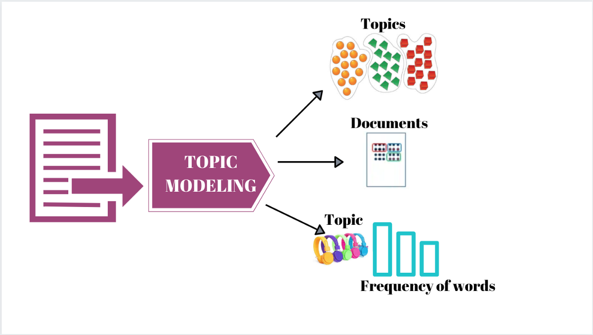

---
output:
  html_document:
    css: Estilos.css
---

# **Modelado de tópicos**

<center></center>

<center>...</center>

<center></center>

+ **Topic Modelling:** Método de análisis no supervisado para clasificación de documentos, que intenta buscar agrupaciones naturales.
+ **LDA (Latent Dirichlet Analysis):** Método de modelamiento de tópicos que trata cada documento como una mixtura de tópicos, donde cada tópico es una mezcla de palabras. Esto permite que los documentos se traslapen, en lugar de separarse. Sin embargo, cada documento tendrá mayor uso de un tópico que de otro.

# **Carga de librerías**

```{r carga_librerias, message=F, warning=F}
library(tidyverse) # Manejo y carga de datos en formato tidy
library(tidytext) # Manejo de texto en formato tidy
library(readxl) # Lectura de archivos excel
library(RColorBrewer) # Paletas de colores
library(kableExtra) # Formato de tablas
library(formattable) # Formato de tablas
library(scales) # Formatos de número
library(topicmodels) # Modelamiento de tópicos
library(ggrepel) # Etiquetas de texto en gráficos
```

# **Matriz Término-Documento**

```{r}
load("NoticiasDF_udpipe_lema.RData")

tidy_NoticiasDF %>%
  count(lemma, titular, sort = TRUE) -> conteos_lemas

conteos_lemas %>%
  cast_dtm(titular, lemma, n) -> DTM_lema

DTM_lema

head(DTM_lema$dimnames$Docs)
head(DTM_lema$dimnames$Terms)
```

# **Modelado LDA**

```{r}
LDA_Result <- LDA(DTM_lema, k = 3, control = list(seed = 123))
LDA_Result
```

```{r}
LDA_Result_tidy <- tidy(LDA_Result, matrix = "beta")
LDA_Result_tidy %>%
  mutate(topic = paste0("topic", topic)) %>%
  spread(topic, beta) %>% 
  arrange(desc(topic1))
```


# **Gráficos resultado**

```{r}

top_terms_per_topic = function(lda_model, num_words) {
  top_terms = lda_model %>%
    group_by(topic) %>%
    arrange(topic, desc(beta)) %>%
    slice(seq_len(num_words)) %>%
    arrange(topic, beta) %>%
    mutate(row = row_number()) %>%
    ungroup() %>%
    mutate(topic = paste("Topic", topic, sep = " "))
  return(top_terms)
}

lda_top_terms = top_terms_per_topic(LDA_Result_tidy, 15)

lda_top_terms %>%
  ggplot(aes(x=as.factor(row), 1, label = lda_top_terms$term, fill = factor(topic) )) +
  geom_point(color = "transparent") +
  geom_label_repel(direction = "y",
                   box.padding = 0.1,
                   size = 6) +
  facet_grid(~topic) +
  labs(x = NULL, y = NULL, title = "Top de palabras por tópico")+
  coord_flip() +
  theme(axis.text.x = element_blank()
        , legend.position = "none")
```

