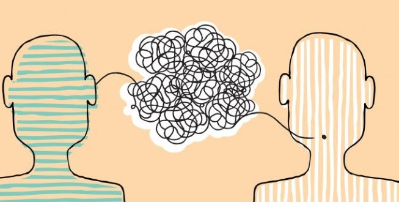

---
output:
  html_document:
    css: Estilos.css
---

 <h1> <b> Adquisición del lenguaje </b> </h1> 

+ Algunas teorías: Dios, Platón, B. Skinner, N. Chomsky.

 <h1> <b> Uso del lenguaje </b> </h1> 

+ 3 categorías de actos del habla: Locutiva, ilocutiva y perlocutiva.
+ 5 tipos de actos ilocutivos: asertivo, directivo, comisivo, expresivo y declarativo.